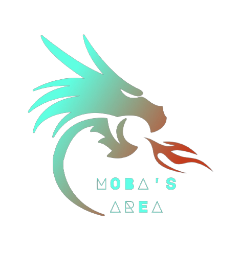

<!-- 
** Thanks for checking out my readme file. If you think adding anymore to this readme will make the readme more good then please do make suggestion.

** simply open an issue with the tag "enhancement" and say what i need to add or change.

** Don't forget to give the project a star!

** Thanks again! now make something AMAZING! :D
 -->
[![MIT License][license-shield]][license-url]
[![Stargazers][stars-shield]][stars-url]
[![LinkedIn][linkedin-shield]][linkedin-url]

<!-- PROJECT LOGO -->
 

  

  <h3 align="center">A website made for MOBA lovers</h3>

  

    An awesome website for MOBA genre fans with many MOBA games listed.
     
    <a href="https://github.com/ArnabDas2001/MOBAs_Area---non-responsive"><strong>Explore the files »</strong></a>
     
     
    <a href="https://arnabdas2001.github.io/MOBAs_Area/">View Demo</a>
    ·
    <a href="https://github.com/ArnabDas2001/MOBAs_Area---non-responsive/issues">Report Bug</a>
    ·
    <a href="https://github.com/ArnabDas2001/MOBAs_Area---non-responsive/issues">Request Feature</a>
  

<!-- TABLE OF CONTENTS -->

  
Table of Contents

  <ol>
    <li>
      <a href="#about-the-project">About The Project</a>
      <ul>
        <li><a href="#built-with">Built With</a></li>
      </ul>
   </li>
    <li><a href="#usage">Usage</a></li>
    <li><a href="#license">License</a></li>
    <li><a href="#contact">Contact</a></li>
    <li><a href="#acknowledgments">Acknowledgments</a></li>
  </ol>

<!-- ABOUT THE PROJECT -->
## About The Project

[![Product Name Screen Shot][product-screenshot]](https://example.com)

There are many great websites on the internet but was missing this awesome website about the MOBA genre. So, I started creating this website for fun and also to learn many things about frontend web development. This website features links to many other famous MOBA game websites out there.

Here I have added the glass morphism effect, parallax effect, sign-up/sign-in overlay function, star.js function, and carousel features too. Hope this is it but if any more features you think will be good then please do suggest them.😊

Of course, no website will serve every aspect since needs may be different from others. So I may be adding more in the near future. You may also suggest changes by opening an issue.

[Note: This website is not responsive for smaller screen sizes like mobile devices yet. So, I suggest viewing this only on a desktop or laptop]

(<a href="#readme-top">back to top</a>)

### Built with

* 
* 
* <a href="https://developer.mozilla.org/en-US/docs/Web/JavaScript" target="_blank"> 

(<a href="#readme-top">back to top</a>)

<!-- USAGE EXAMPLES -->
## Usage

This project can be used as a template to make other projects or to understand some features of CSS to implement more things for others.
 
This project has many more possibilities but all are not implemented here so make one and improve it more. And always you can come and play MOBA games cause they are also a good game genre. You can come here and follow your favorite MOBA games to get the latest news about them.

(<a href="#readme-top">back to top</a>)

 
<!-- LICENSE -->
## License

Distributed under the MIT License. See `LICENSE.md` for more information.

(<a href="#readme-top">back to top</a>)

 
<!-- CONTACT -->
## Contact

- dasarnab389@gmail.com

Project Link: [https://github.com/ArnabDas2001/MOBAs_Area---non-responsive](https://github.com/ArnabDas2001/MOBAs_Area---non-responsive)

(<a href="#readme-top">back to top</a>)

 
 <!-- ACKNOWLEDGMENTS -->
## Acknowledgments

Thanks to all these websites for the completion of my project

* [Choose an Open Source License](https://choosealicense.com)
* [GitHub Emoji Cheat Sheet](https://www.webpagefx.com/tools/emoji-cheat-sheet)
* [Img Shields](https://shields.io)
* [GitHub Pages](https://pages.github.com)
* [Font Awesome](https://fontawesome.com)
* [Youtube](https://www.youtube.com/?feature=ytca)
* [Codepen](https://codepen.io/)
 
And also special thanks to 

* <a href="https://github.com/PriyoRaven">Priyadarsi Halder</a>
 
 Without all help, this project would not have been completed.
 

(<a href="#readme-top">back to top</a>)

 
<!-- ** Mark downlinks and URLS -->
[license-shield]: https://img.shields.io/github/license/PriyoRaven/MOBA.svg?style=for-the-badge
[license-url]: https://github.com/ArnabDas2001/MOBAs_Area---non-responsive/blob/main/LICENSE.md
[stars-shield]: https://img.shields.io/github/stars/PriyoRaven/MOBA.svg?style=for-the-badge
[stars-url]: https://github.com/ArnabDas2001/MOBAs_Area---non-responsive/stargazers
[linkedin-shield]: https://img.shields.io/badge/-LinkedIn-black.svg?style=for-the-badge&logo=linkedin&colorB=555
[linkedin-url]: https://www.linkedin.com/in/arnab-das-363247251/
[product-screenshot]: Gallary/mobaSArea_face.png
